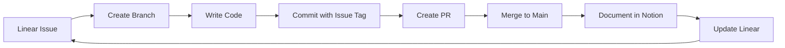

# AI Learning Lab - Daily Workflow Guide

## 🎯 Overview

This document describes the integrated workflow across GitHub, Linear, and Notion for the AI/ML Learning Journey.

## 📊 Daily Learning Flow

```
1. Review → 2. Plan → 3. Execute → 4. Document → 5. Reflect
    ↓          ↓          ↓           ↓            ↓
  Linear    Linear    GitHub      Notion       Notion
  Issues    Issues     Code       Experiments   Insights
```

### Morning Routine (15 min)
1. **Check Linear** - Review active issues and daily goals
2. **Check Notion** - Review yesterday's experiments and insights
3. **Plan Today** - Select 1-2 issues to focus on

### Learning Session (2-4 hours)
1. **Pick Issue** - Choose from Linear backlog (YEP-5, YEP-6, etc.)
2. **Create Branch** - Follow naming convention
3. **Code & Learn** - Implement, experiment, take notes
4. **Commit Often** - Link commits to issues
5. **Document** - Add experiments to Notion

### Evening Routine (15 min)
1. **Push Code** - Commit and push your work
2. **Update Linear** - Mark progress, close completed issues
3. **Journal in Notion** - What did you learn? What's next?

## 🔄 Issue → Code → Documentation Flow



### Step-by-Step Process

#### 1. Start with Linear Issue
```bash
# Example: Working on YEP-7 (Complete API Quickstart)
# Issue URL: https://linear.app/yep-learn-ai/issue/YEP-7/
```

#### 2. Create Feature Branch
```bash
git checkout main
git pull
git checkout -b feature/yep-7-api-quickstart
```

#### 3. Work and Commit
```bash
# Make changes
git add .
git commit -m "feat: Complete API quickstart examples [YEP-7]"
```

#### 4. Push and Create PR
```bash
git push origin feature/yep-7-api-quickstart
# Create PR on GitHub with description linking to YEP-7
```

#### 5. Document Learning in Notion
- Create experiment page
- Link to GitHub commit/PR
- Link to Linear issue
- Add insights and learnings

#### 6. Update Linear
- Mark issue as "Done"
- Add links to GitHub PR and Notion page
- Move to next issue

## 📝 Branch Naming Conventions

### Format
```
<type>/<issue-id>-<short-description>
```

### Types
- `feature/` - New learning module or capability
- `experiment/` - Trying something new
- `fix/` - Fixing bugs or issues
- `docs/` - Documentation updates
- `refactor/` - Code improvements

### Examples
```bash
feature/yep-7-api-quickstart
experiment/yep-8-streaming-responses
fix/yep-9-memory-persistence
docs/yep-10-week-4-checkpoint
refactor/yep-8-cli-improvements
```

## 💬 Commit Message Format

### Convention: Conventional Commits
```
<type>(<scope>): <description> [Issue-ID]

[optional body]

[optional footer]
```

### Types
- `feat` - New feature or learning completed
- `fix` - Bug fix
- `docs` - Documentation changes
- `style` - Formatting, missing semicolons, etc.
- `refactor` - Code restructuring
- `test` - Adding tests
- `chore` - Maintenance tasks

### Examples
```bash
feat: Complete Anthropic API quickstart [YEP-7]

- Tested temperature settings (0.0 to 1.0)
- Experimented with max_tokens
- Implemented streaming responses

feat(cli): Add conversation history display [YEP-8]

fix(memory): Resolve JSON serialization error [YEP-9]

docs: Add API key setup instructions [YEP-5]

refactor(cli): Improve error handling patterns [YEP-8]
```

### Issue Tagging
Always include Linear issue ID in square brackets at the end:
```
[YEP-X]
```

This automatically links commits to Linear issues.

## 📋 Pull Request Template

```markdown
## Description
Brief description of what this PR accomplishes

## Related Issue
Closes [YEP-X](https://linear.app/yep-learn-ai/issue/YEP-X/)

## What I Learned
- Key insight 1
- Key insight 2
- Key insight 3

## Changes Made
- Change 1
- Change 2
- Change 3

## Testing
How did you verify this works?

## Notion Documentation
Link to Notion experiment/documentation: [Title](URL)

## Checklist
- [ ] Code follows project conventions
- [ ] Committed with proper message format
- [ ] Documented learning in Notion
- [ ] Updated Linear issue
- [ ] Ready to merge
```

## 🔗 System Integration

### GitHub ↔ Linear
- Commits with `[YEP-X]` automatically link to Linear
- PRs can close Linear issues with "Closes YEP-X"
- Branch names should include issue identifier

### Linear ↔ Notion
- Link Linear issues in Notion experiments
- Reference Notion pages in Linear issue comments
- Use consistent naming and cross-references

### GitHub ↔ Notion
- Link GitHub commits/PRs in Notion experiments
- Include code snippets in Notion documentation
- Reference Notion pages in PR descriptions

## 🎓 Learning Workflow Examples

### Example 1: API Quickstart (YEP-7)
1. **Linear**: Open YEP-7, review requirements
2. **GitHub**: Create branch `feature/yep-7-api-quickstart`
3. **Code**: Complete quickstart exercises
4. **Commit**: `feat: Complete API quickstart examples [YEP-7]`
5. **Notion**: Document experiments and learnings
6. **Linear**: Mark YEP-7 as "Done", add links

### Example 2: Build CLI App (YEP-8)
1. **Linear**: Open YEP-8, review features needed
2. **GitHub**: Create branch `feature/yep-8-cli-chat`
3. **Code**: Build CLI application iteratively
4. **Commits**: 
   - `feat(cli): Add basic chat loop [YEP-8]`
   - `feat(cli): Implement streaming [YEP-8]`
   - `feat(cli): Add history display [YEP-8]`
5. **PR**: Create PR with full description
6. **Notion**: Document architecture and learnings
7. **Linear**: Mark YEP-8 as "Done"

### Example 3: Weekly Checkpoint (YEP-10)
1. **Linear**: Open YEP-10, review checklist
2. **Notion**: Create checkpoint reflection page
3. **Review**: Check all completed issues
4. **Document**: Write comprehensive checkpoint summary
5. **Linear**: Complete self-assessment in YEP-10
6. **Celebrate**: Acknowledge progress! 🎉

## 🚀 Pro Tips

### Daily Habits
- Start each day by checking Linear issues
- Commit frequently with descriptive messages
- Document while you learn, not after
- Link everything - issues, commits, experiments
- End each day with a progress update

### Quality Practices
- **Small Commits**: Commit logical units of work
- **Clear Messages**: Future you will thank present you
- **Link Everything**: Create bidirectional references
- **Document Insights**: Write down "aha!" moments
- **Review Regularly**: Weekly checkpoints are crucial

### When You're Stuck
1. Check Linear issue description for guidance
2. Review related Notion experiments
3. Look at previous GitHub commits
4. Ask in Linear comments
5. Document what you tried (even if it didn't work)

## 📚 Quick Reference

### Linear Issue States
- **Backlog**: Not started yet
- **Todo**: Ready to work on
- **In Progress**: Currently working on
- **Done**: Completed

### Priority Levels
- 🔴 P0 Critical: Setup and foundations
- 🟠 P1 High: Core learning objectives
- 🟡 P2 Medium: Additional practice
- 🟢 P3 Low: Nice to have

### Labels
- 📘 phase-1-foundations
- 🔍 phase-2-rag
- 🤖 phase-3-agentic
- 🎯 milestone
- 💻 hands-on-lab
- 📖 learning
- 🚀 production

## 🎯 Success Metrics

Track your progress:
- [ ] Completing issues consistently
- [ ] Commits linked to issues
- [ ] Documentation in Notion up-to-date
- [ ] Weekly checkpoints completed
- [ ] Portfolio projects deployed

---

**Remember**: The goal is learning, not perfection. Document your journey, celebrate progress, and keep moving forward! 🚀
